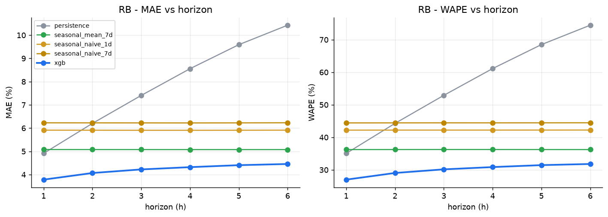
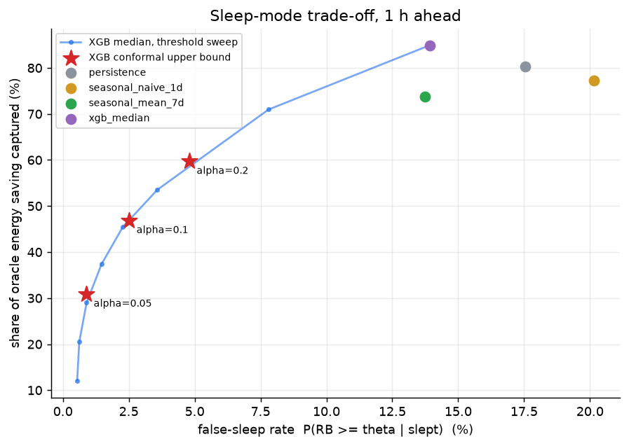
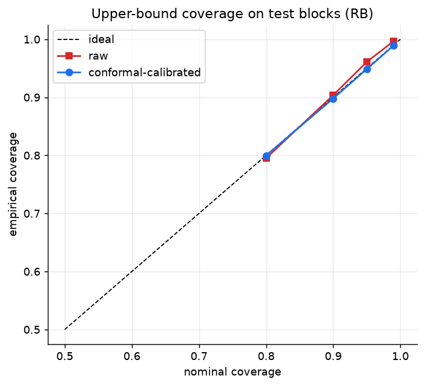

# LTE Traffic Forecasting for Proactive RAN Optimization

> **Can machine-learning models accurately forecast LTE cell traffic and radio-resource utilisation 1-6 hours ahead using real operational RAN performance counters - and is that forecast good enough to switch cells off safely?**

Real data: 15-minute PM counters from a commercial mobile network in Slovakia (LTE 1800 MHz, per base station and sector),
[Zenodo 10.5281/zenodo.17815388](https://doi.org/10.5281/zenodo.17815388), CC BY 4.0, published in _Scientific Data_ (2026).

## What this project does

1. **Audited data pipeline.** Complete 15-min grid per sector; idle slots kept as 0 % (not dropped), outages kept as gaps (never zero-filled); duplicates merged; every assumption is measured in `data_audit.json`.
2. **Multi-horizon forecasting (1-6 h)** of **PRB/RB utilisation** and **DL data volume** with gradient-boosted quantile models (native XGBoost, 50+ leakage-tested features incl. seasonal values aligned to the target slot).
3. **Honest baselines**: persistence, seasonal naive (1 d, 7 d), 7-day seasonal mean - all aligned to the forecast target and scored on identical rows.
4. **Rigorous evaluation**: 3 rolling-origin folds, target-time splits with embargo, paired block-bootstrap confidence intervals against the strongest baseline.
5. **Calibrated uncertainty**: one-sided split-conformal upper bounds; realised coverage re-measured on each untouched test block.
6. **Decision layer - energy-saving sleep mode**: policies built on point forecasts vs calibrated bounds, scored by false-sleep rate, displaced traffic and captured energy saving, including a threshold-sweep competitor so the benefit of calibration is tested rather than assumed.

## Results

<!-- RESULTS:START -->

**Scope of the analysis.** 65 of the 184 sectors in the file were analysed (the other 119 are observed in less than 50 % of the 86-day window); about 29 % of the remaining 15-min slots are gaps and were never imputed. RB utilisation is capped at about 74.5 % in this data, so congestion above 85 % cannot be evaluated.

**Headline findings** (3 rolling test weeks, 95 % block-bootstrap intervals exclude zero at every horizon)

- RB utilisation 1 h ahead: MAE 3.78 vs 4.91 for persistence (-23 %); 6 h ahead: 4.46 vs 5.08 for the 7-day seasonal mean, the strongest baseline (-12 %).
- DL volume 1 h ahead: WAPE 29.8 % vs 38.1 % for persistence.
- Conformal upper bounds reach their nominal level on average (nominal 0.90 -> 0.898). Per test week the 90 % bound covered 91.2 %, 86.2 % and 92.1 %: the average hides one under-covered week (distribution drift; time series are not exactly exchangeable).
- Sleep decisions: the median forecast has the same false-sleep rate as the 7-day seasonal mean at 1 h (13.9 % vs 13.8 %) with 85 % vs 74 % of the possible saving captured, and is far safer than persistence at 6 h (15 % vs 40 % false sleeps). Even so, a plain median rule falsely sleeps about 14 % of the time - not deployable as is.
- Calibrated bounds give a risk level you choose in advance (e.g. alpha = 0.05: 0.9 % false sleeps, 31 % of the saving captured at 1 h) but, compared with simply lowering the threshold on the median forecast, they sit on the same trade-off curve. Their value is predictable risk control, not a better frontier.
- Energy figures are a scenario (assumed residual power of a sleeping radio unit), not measurements.





<details><summary>Full generated summary (results/summary.md)</summary>

### Data audit

- Raw rows: 1800920, cells: 65 kept of 184, span: 86.5 days (2025-02-07 19:45:00 to 2025-05-05 07:15:00)
- Exact duplicate rows removed: 0; same-key rows merged: 1078375
- RB utilisation NaN share: 0.6426; of which rows with DL volume reported as 0 (idle, set to 0 %): 0.0403
- Idle slots (RB = 0) in the grid: 0.0626; true gaps: 0.2941
- Share of RB values above 85 %: 0.0
- Max RB utilisation in the data: 74.5 %

### RB utilisation: MAE (%-points), mean over test folds

| horizon | xgb   | persistence | seasonal_naive_1d | seasonal_naive_7d | seasonal_mean_7d |
| ------- | ----- | ----------- | ----------------- | ----------------- | ---------------- |
| 1       | 3.784 | 4.913       | 5.913             | 6.228             | 5.079            |
| 2       | 4.069 | 6.203       | 5.911             | 6.226             | 5.078            |
| 3       | 4.223 | 7.406       | 5.908             | 6.225             | 5.077            |
| 4       | 4.321 | 8.557       | 5.908             | 6.224             | 5.076            |
| 5       | 4.406 | 9.590       | 5.910             | 6.226             | 5.076            |
| 6       | 4.457 | 10.429      | 5.913             | 6.230             | 5.076            |

### Model vs strongest baseline (pooled test rows; 95 % block-bootstrap CI of MAE difference, model - baseline)

| horizon | best_baseline    | mae_model | mae_baseline | diff   | diff_lo | diff_hi | skill_pct |
| ------- | ---------------- | --------- | ------------ | ------ | ------- | ------- | --------- |
| 1       | persistence      | 3.785     | 4.914        | -1.130 | -1.167  | -1.093  | 22.985    |
| 2       | seasonal_mean_7d | 4.070     | 5.081        | -1.010 | -1.089  | -0.926  | 19.888    |
| 3       | seasonal_mean_7d | 4.225     | 5.080        | -0.855 | -0.930  | -0.779  | 16.825    |
| 4       | seasonal_mean_7d | 4.323     | 5.079        | -0.756 | -0.827  | -0.684  | 14.879    |
| 5       | seasonal_mean_7d | 4.409     | 5.078        | -0.670 | -0.738  | -0.596  | 13.188    |
| 6       | seasonal_mean_7d | 4.460     | 5.079        | -0.619 | -0.685  | -0.545  | 12.185    |

### XGBoost RB: other point metrics

| horizon | rmse  | wape   | bias   |
| ------- | ----- | ------ | ------ |
| 1       | 5.888 | 26.995 | -0.989 |
| 2       | 6.295 | 29.043 | -1.020 |
| 3       | 6.536 | 30.157 | -0.977 |
| 4       | 6.692 | 30.855 | -0.956 |
| 5       | 6.840 | 31.455 | -0.913 |
| 6       | 6.920 | 31.805 | -0.889 |

### DL data volume: WAPE (%), mean over test folds

| horizon | xgb    | persistence | seasonal_naive_1d | seasonal_naive_7d | seasonal_mean_7d |
| ------- | ------ | ----------- | ----------------- | ----------------- | ---------------- |
| 1       | 29.815 | 38.081      | 45.537            | 47.826            | 38.129           |
| 2       | 31.985 | 46.953      | 45.549            | 47.835            | 38.141           |
| 3       | 33.011 | 54.945      | 45.546            | 47.860            | 38.156           |
| 4       | 33.764 | 62.368      | 45.547            | 47.863            | 38.154           |
| 5       | 34.222 | 69.054      | 45.549            | 47.858            | 38.145           |
| 6       | 34.492 | 74.276      | 45.552            | 47.866            | 38.142           |

### Upper-bound coverage on test blocks (RB, mean over horizons and folds)

| nominal | coverage_raw | coverage_conformal |
| ------- | ------------ | ------------------ |
| 0.800   | 0.795        | 0.800              |
| 0.900   | 0.904        | 0.898              |
| 0.950   | 0.961        | 0.949              |
| 0.990   | 0.997        | 0.989              |

### Sleep-mode policies, 1 h ahead (theta = 10.0 % RB, residual power 30%)

| policy              | sleep_share | false_sleep_rate | severe_rate | displaced_share | energy_saved_pct | capture | precision | recall |
| ------------------- | ----------- | ---------------- | ----------- | --------------- | ---------------- | ------- | --------- | ------ |
| oracle              | 0.490       | 0.000            | 0.000       | 0.155           | 29.491           | 1.000   | 1.000     | 1.000  |
| persistence         | 0.491       | 0.175            | 0.004       | 0.203           | 23.673           | 0.803   | 0.825     | 0.825  |
| seasonal_naive_1d   | 0.490       | 0.202            | 0.008       | 0.220           | 22.767           | 0.772   | 0.798     | 0.799  |
| seasonal_mean_7d    | 0.440       | 0.138            | 0.003       | 0.166           | 21.752           | 0.738   | 0.862     | 0.773  |
| xgb_median          | 0.496       | 0.139            | 0.002       | 0.191           | 25.037           | 0.849   | 0.861     | 0.871  |
| xgb_conformal_a0.2  | 0.332       | 0.048            | 0.001       | 0.084           | 17.619           | 0.597   | 0.952     | 0.644  |
| xgb_conformal_a0.1  | 0.263       | 0.025            | 0.001       | 0.050           | 13.826           | 0.469   | 0.975     | 0.522  |
| xgb_conformal_a0.05 | 0.180       | 0.009            | 0.000       | 0.021           | 9.114            | 0.309   | 0.991     | 0.365  |
| xgb_conformal_a0.01 | 0.000       | -                | -           | 0.000           | 0.000            | 0.000   | -         | 0.000  |

### Sleep-mode policies, 3 h ahead (theta = 10.0 % RB, residual power 30%)

| policy              | sleep_share | false_sleep_rate | severe_rate | displaced_share | energy_saved_pct | capture | precision | recall |
| ------------------- | ----------- | ---------------- | ----------- | --------------- | ---------------- | ------- | --------- | ------ |
| oracle              | 0.491       | 0.000            | 0.000       | 0.155           | 29.523           | 1.000   | 1.000     | 1.000  |
| persistence         | 0.490       | 0.270            | 0.017       | 0.261           | 20.781           | 0.704   | 0.730     | 0.729  |
| seasonal_naive_1d   | 0.491       | 0.201            | 0.008       | 0.221           | 22.798           | 0.772   | 0.799     | 0.799  |
| seasonal_mean_7d    | 0.440       | 0.137            | 0.003       | 0.166           | 21.788           | 0.738   | 0.863     | 0.774  |
| xgb_median          | 0.488       | 0.148            | 0.003       | 0.193           | 24.255           | 0.822   | 0.852     | 0.848  |
| xgb_conformal_a0.2  | 0.319       | 0.054            | 0.001       | 0.081           | 16.699           | 0.566   | 0.946     | 0.615  |
| xgb_conformal_a0.1  | 0.243       | 0.027            | 0.000       | 0.046           | 12.597           | 0.427   | 0.973     | 0.482  |
| xgb_conformal_a0.05 | 0.144       | 0.010            | 0.000       | 0.015           | 6.999            | 0.237   | 0.990     | 0.290  |
| xgb_conformal_a0.01 | 0.000       | -                | -           | 0.000           | 0.000            | 0.000   | -         | 0.000  |

### Sleep-mode policies, 6 h ahead (theta = 10.0 % RB, residual power 30%)

| policy              | sleep_share | false_sleep_rate | severe_rate | displaced_share | energy_saved_pct | capture | precision | recall |
| ------------------- | ----------- | ---------------- | ----------- | --------------- | ---------------- | ------- | --------- | ------ |
| oracle              | 0.491       | 0.000            | 0.000       | 0.155           | 29.519           | 1.000   | 1.000     | 1.000  |
| persistence         | 0.490       | 0.401            | 0.048       | 0.357           | 16.940           | 0.574   | 0.599     | 0.598  |
| seasonal_naive_1d   | 0.491       | 0.201            | 0.008       | 0.221           | 22.789           | 0.772   | 0.799     | 0.799  |
| seasonal_mean_7d    | 0.440       | 0.137            | 0.003       | 0.166           | 21.782           | 0.738   | 0.863     | 0.774  |
| xgb_median          | 0.487       | 0.151            | 0.003       | 0.194           | 24.096           | 0.816   | 0.849     | 0.843  |
| xgb_conformal_a0.2  | 0.310       | 0.053            | 0.001       | 0.078           | 16.209           | 0.549   | 0.947     | 0.599  |
| xgb_conformal_a0.1  | 0.237       | 0.026            | 0.001       | 0.043           | 12.200           | 0.413   | 0.974     | 0.469  |
| xgb_conformal_a0.05 | 0.135       | 0.011            | 0.000       | 0.014           | 6.520            | 0.221   | 0.989     | 0.273  |
| xgb_conformal_a0.01 | 0.000       | -                | -           | 0.000           | 0.000            | 0.000   | -         | 0.000  |

</details>
<!-- RESULTS:END -->

## Quick start

```bash
python -m venv .venv && source .venv/bin/activate      # Windows: .venv\Scripts\activate
pip install -r requirements-dev.txt

python -m pytest                                        # 17 tests: leakage, splits, conformal, pipeline smoke test
python scripts/run_pipeline.py --synthetic --fast       # 1-minute dry run on generated data (no download)

python scripts/download_data.py                         # fetch + checksum Dataset_02.zip into data/
jupyter lab notebooks/01_data_audit_and_eda.ipynb       # CHECK the audit first (idle semantics, duplicates, congestion share)
python scripts/run_pipeline.py                          # full run, outputs in results/
```

Runtime of the full default configuration (about 190 sectors x 80 days, 3 folds x 6 horizons x 2 targets): roughly 1-1.5 h on a single core,
substantially less on a multi-core machine (measured ~4 min per fold/horizon on 1 core for RB + volume models). `--fast` takes a few minutes.
Needs ~4 GB RAM. The code uses only numpy, pandas, matplotlib, xgboost and pyarrow - no scikit-learn.

Outputs in `results/`: `summary.md`, `metrics_by_fold.csv`, `rb_vs_best_baseline.csv`, `calibration.csv`, `sleep_policy.csv`,
`feature_importance_rb.csv`, `data_audit.json`, `run_config.json`, `figures/*.png`.
`docs/example_output_synthetic/` shows the format of these outputs on synthetic data (watermarked; not real results).

## Repository layout

```
configs/default.toml        all experiment settings
src/lte_forecast/           data, features, splits, baselines, models, conformal, sleep, metrics, plots, pipeline
scripts/                    run_pipeline.py, download_data.py, update_readme.py
tests/                      leakage / split / metric / conformal / sleep / end-to-end tests
notebooks/                  01 data audit + EDA, 02 results explorer
docs/methodology.md         every design decision and its rationale; limitations
archive/                    first iteration (notebooks 01-07) and the list of issues fixed (archive/README.md)
```

## Limitations (read before quoting numbers)

- ~3 months of data (86 days), 65 of 184 sectors usable, 29 % gap slots: no yearly seasonality; RB utilisation never exceeds ~74.5 %, so traffic-steering/congestion decisions are not evaluated.
- Energy savings are a **scenario** (assumed residual power of a sleeping radio unit); the dataset has no sleep ground truth, no coverage-layer information, and radio-unit energy may be shared across bands. Use the savings figure to rank policies, not to promise operator savings.
- Conformal guarantees assume exchangeability; time series only approximately satisfy it. One of the three test weeks under-covers the 90 % bound (86.2 %).
- Conformal bounds do not beat a threshold sweep on the median forecast; they provide predictable risk control.
- One operator, one band, no neighbour/geo features, no hyper-parameter search (by design - keeps the calibration block untouched).

Details: [`docs/methodology.md`](docs/methodology.md).

## Authors

- **Abdelkader ABBES** - data pipeline and cleaning, feature engineering, rolling splits, model training, pipeline/CLI, results and write-up.
- **Adjal Ziad Mahieddine** - baselines and metrics, conformal calibration, sleep-mode policy analysis, test suite, data-audit notebook, methodology document.

## Citation

Please cite the dataset: P. Lehoczky, M. Turcsany, L. Krajcovicova, F. Zatroch, M. Kajan, M. Galinski, _Performance Management Counters from Live 5G, 4G and 2G Radio Access Network_, Scientific Data (2026), doi:10.1038/s41597-026-07723-0; data: doi:10.5281/zenodo.17815388 (CC BY 4.0).

Code: MIT licence.
